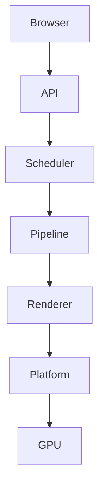
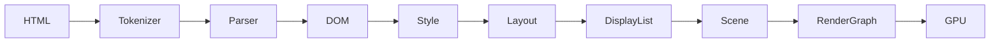

# Panther

Panther is a GUI browser built on the Purr engine.

The Purr engine is a rendering engine written in Rust. The engine uses GPU-first
rendering and targets Linux, macOS, and Windows.

## Project Status

Panther is in early development. The project has not released any code yet.
The interfaces, features, and architecture described in this document can
change without notice.

## Vision

Purr aims to provide a modern rendering engine that is correct, fast, portable,
maintainable, and simple. Panther is the graphical browser built on top of this
engine. A companion terminal browser, Puma, uses the same engine.

Core principles:

- Correctness before optimization.
- Explicit architecture.
- Data-oriented design.
- Incremental rendering.
- GPU acceleration.
- Resource awareness.
- Long-term maintainability.

## Planned Features

- Command palette.
- Dockable panels.
- Native, GPU-rendered interface.
- Keyboard-first workflow.

## Architecture

Panther sits on top of a layered rendering pipeline:

## Roadmap

The project follows an incremental roadmap, from the engine architecture
through the tokenizer, parser, DOM, CSS, layout, rendering, and GPU stages,
before the Panther and Puma applications are built on top.

## Contributing

Read [CONTRIBUTING.md](CONTRIBUTING.md) before you open an issue or a pull
request.

## Code of Conduct

This project follows the [Code of Conduct](CODE_OF_CONDUCT.md). All
contributors must follow it.

## Security

Read [SECURITY.md](SECURITY.md) to report a security issue.

## License

This project uses the MIT license. Read [LICENSE](LICENSE) for the full text.
